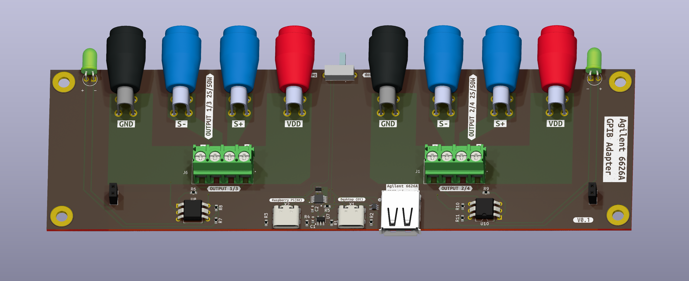
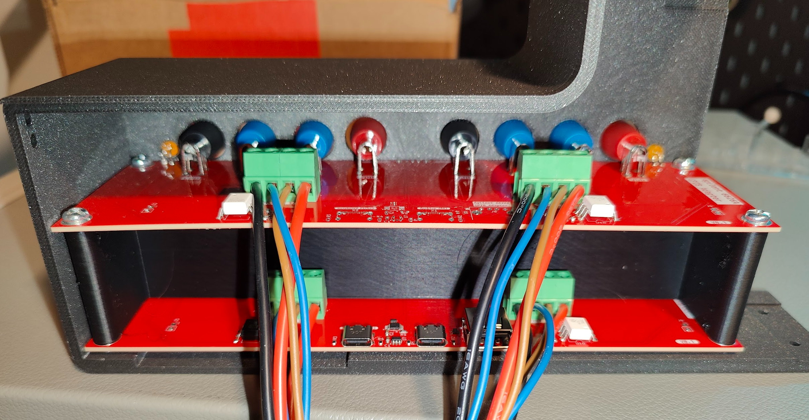
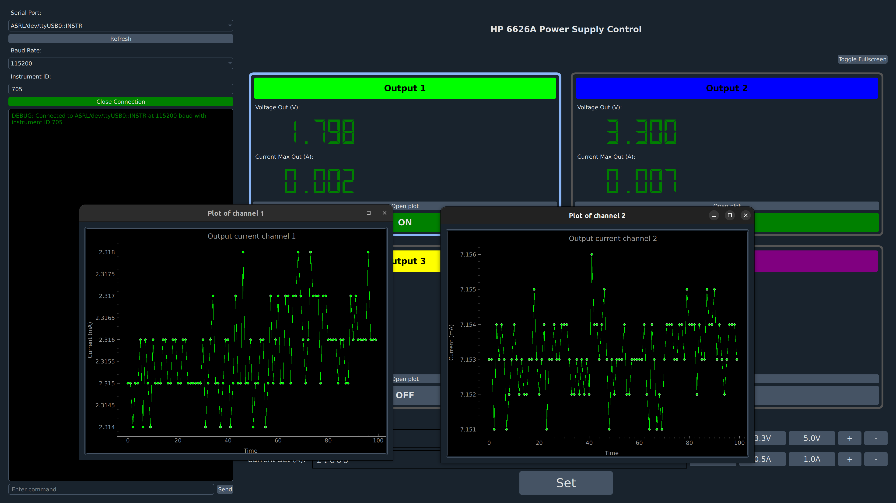
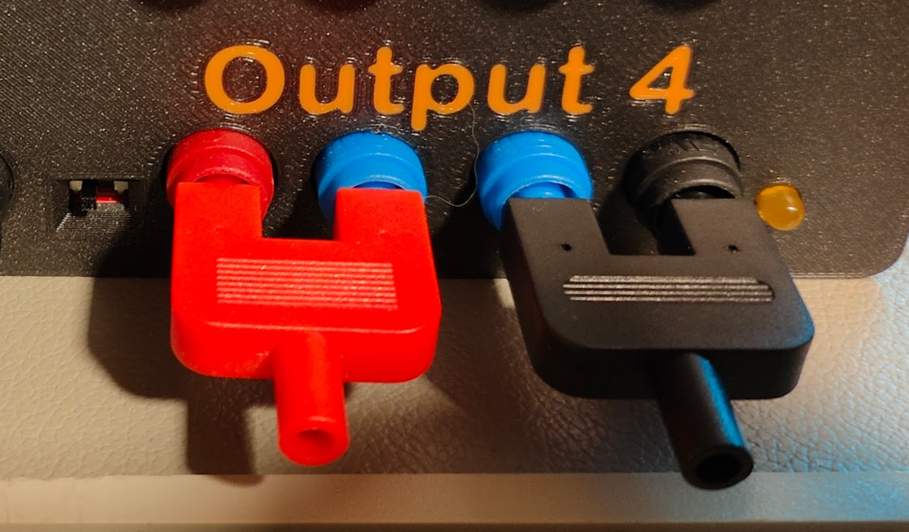

# Remote UI control of Agilent 6626A DC Power Supply 
Making an old (but very good) power supply a bit more modern by giving it a nice new touch UI with remote control.


## GPIB Communication
To communicate with the instrument, I'm using the awesome [AR488 GPIB <-> UART FW](https://github.com/Twilight-Logic/AR488/tree/master). It is flashed on an Arduino Nano sitting on a simple custom PCB, which breaks out the GPIB connector. This setup allows you to easily interact with test instruments.

## The PCB

The power supply outputs are placed on the back of the instrument making them a bit hard to access. To solve this I designed a breakout PCB that through screw terminals guide the four power supply outputs to easily accessible banana plugs.

The breakout PCB also includes some extra features:
- USB A connector that connects to the power supply through the GPIB <-> UART bridge.
- Two USB C connectors that can connect to different hosts, such as a computer and a Raspberry Pi.
- USB switch (controlled through a switch) that routes the GPIB USB to either of the two USB C connectors.
- 4 optocouplers controlling 4 LEDs (one for each output) to indicate if power is enabled or not.
  - Due to the four outputs having separate grounds, I use optocouplers to isolate the LED from the actual output.

<p float="left">
    
    
</p>

## The UI
Used PyQt5 to design a decent looking UI to graphically interact with the power supply.
Behind the scenes GPIB commands are sent to the power supply to make it do what we want.



### GPIB Commands
The control interface is quite simple. For example to set output 1 to 5V, max 0.1A it's as simple as this:
```plaintext
VSET 1,1.8000
ISET 1,0.1000
```
You can also query stuff such as the actual voltage at the output and current being drawn. This is what's being used to display the realtime plots.
```plaintext
VOUT? 1
<now read response>
IOUT? 1
<now read response>
```

## Using the sensing inputs
The sensing inputs are also routed to the new front panel. The default way to use them is to short the V_out to Sense+ and GND to Sense- on the front panel using a simple 2-1 banana plug. When these are connected, the power supply's sense feature will compensate for voltage loss in the cables running from the back of the power supply to the new front panel.

To allow for more advanced use, simply remove the 2-1 banana plug, giving you free access to the Sense+ and Sense- on each output.




## ToDo
- The UI needs some tweaking to be easier to use on the 7 inch touch screen connected to a Raspberry Pi.


## References
[6628A Power Supply User Guide](https://www.keysight.com/us/en/assets/9018-01123/user-manuals/9018-01123.pdf)